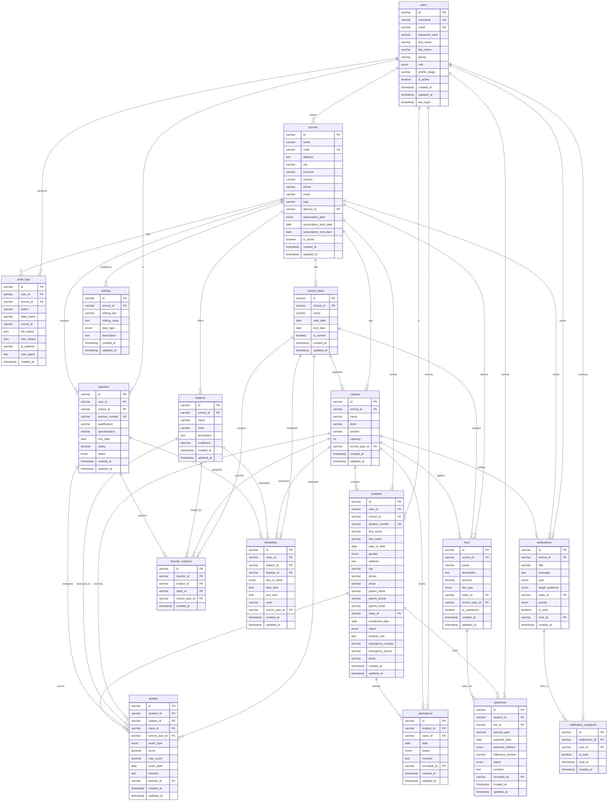

# Diagramme ER - Smart Ekele Database

## Relations principales

### Hiérarchie des utilisateurs
- **users** (table centrale pour tous les utilisateurs)
  - School Director (gère une école)
  - Teacher (enseigne dans une école)

### Structure académique
- **schools** → **school_years** → **classes** → **students**
- **schools** → **subjects**
- **teachers** ↔ **subjects** ↔ **classes** (via teacher_subjects)

### Gestion académique
- **students** → **attendance** (présences)
- **students** → **grades** (notes)
- **classes** → **timetables** (emplois du temps)

### Gestion financière
- **schools** → **fees** (définition des frais)
- **students** → **payments** (paiements effectués)
- **fees** ↔ **payments**

### Communication
- **notifications** (envoyées par l'école)
- **notification_recipients** (destinataires individuels)

### Sécurité et audit
- **audit_logs** (traçabilité de toutes les actions)
- **settings** (paramètres configurables par école)
